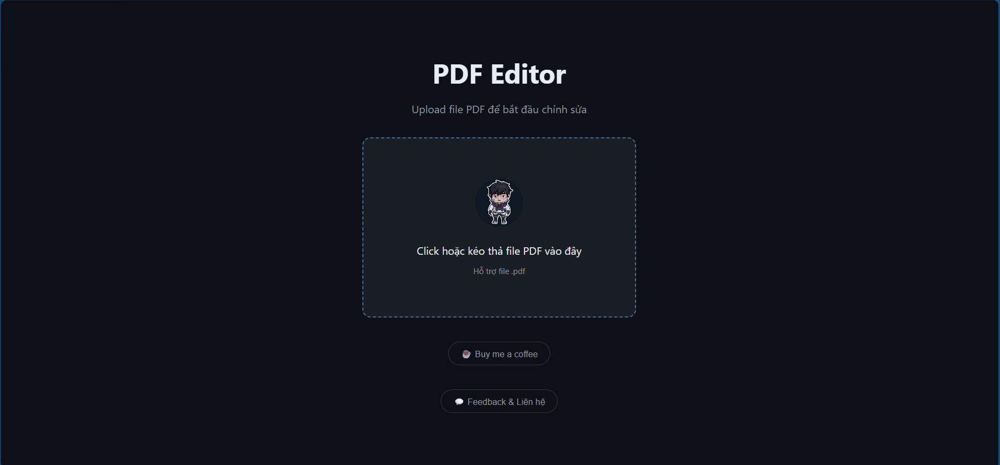
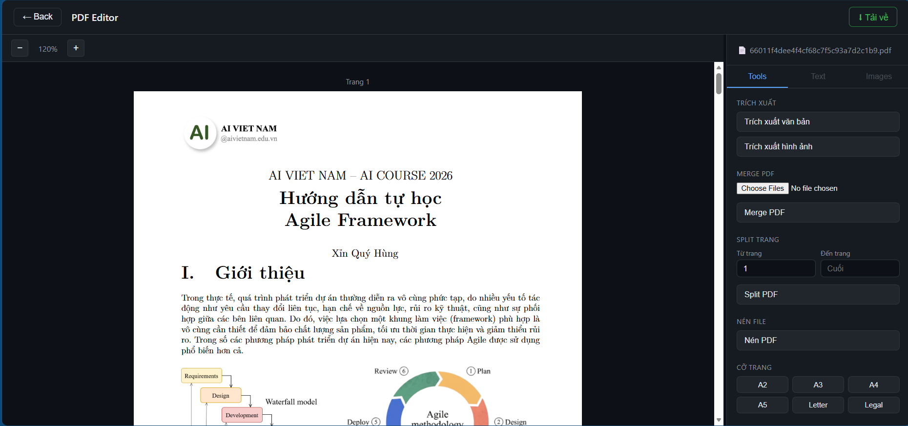
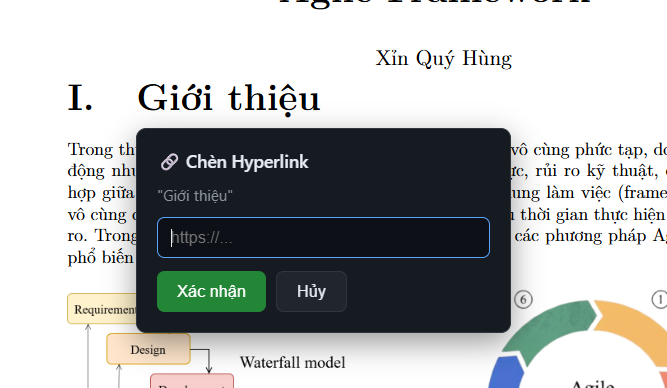
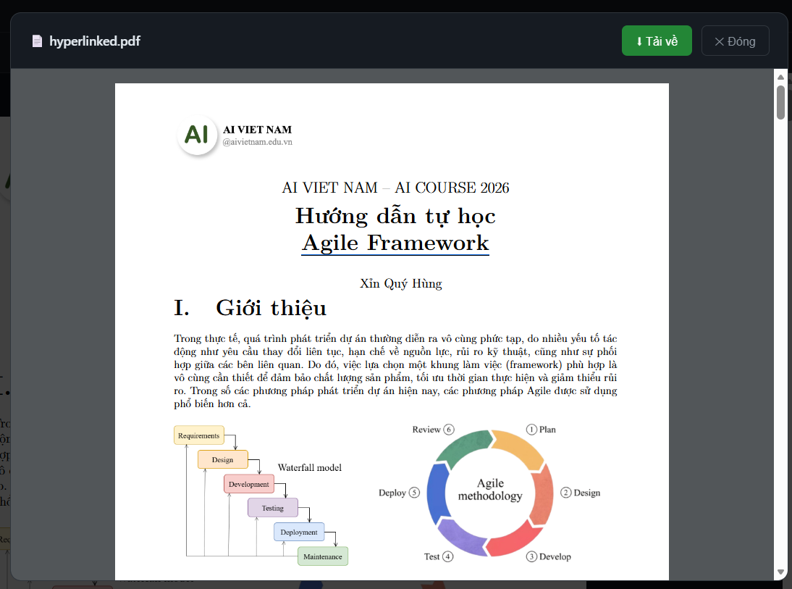

# PDF Editor

A full-stack web application for viewing and editing PDF files directly in the browser.

**Live demo:** https://pdf-editor-prj.vercel.app

---

## Demo

<!-- Insert demo screenshot here -->


---

## Features

- **PDF Viewer** — render multi-page PDFs with zoom in/out and resizable sidebar
- **Extract** — extract text content or images from a PDF
- **Merge** — combine multiple PDF files into one
- **Split** — extract a page range from a PDF into a new file
- **Compress** — reduce PDF file size
- **Hyperlink** — select text and insert a clickable URI annotation with underline style
- **Preview before download** — all operations show a preview modal; download only when satisfied

---

## Tech Stack

| Layer    | Technology                          |
|----------|-------------------------------------|
| Frontend | React 19, Vite, react-pdf (pdfjs)   |
| Backend  | FastAPI, Python, pypdf, PyMuPDF     |
| Deploy   | Vercel (frontend), Render (backend) |

---

## Screenshots

### Home

<!-- Insert home page screenshot here -->


### PDF Viewer & Sidebar

<!-- Insert editor screenshot here -->


### Hyperlink Insertion

<!-- Insert hyperlink demo screenshot here -->


### Preview Modal

<!-- Insert preview modal screenshot here -->


---

## Getting Started

### Prerequisites

- Node.js >= 18
- Python >= 3.10
- Conda (recommended)

### Backend

```bash
cd backend
conda create -n pdf-editor python=3.11
conda activate pdf-editor
pip install fastapi uvicorn pypdf pymupdf python-multipart
uvicorn main:app --reload
```

Backend runs at `http://localhost:8000`.

### Frontend

```bash
cd frontend
npm install
npm run dev
```

Frontend runs at `http://localhost:5173`.

---

## Project Structure

```
pdf-editor/
├── backend/
│   ├── main.py
│   └── routers/
│       ├── compress.py
│       ├── extract.py
│       ├── hyperlink.py
│       └── merge_split.py
└── frontend/
    └── src/
        ├── components/
        │   ├── HyperlinkPopup.jsx
        │   ├── PDFViewer.jsx
        │   ├── ResultPreview.jsx
        │   └── Sidebar.jsx
        ├── pages/
        │   ├── Editor.jsx
        │   └── Home.jsx
        └── services/
            └── api.js
```

---

## Deployment

- **Frontend** — push to `main`, Vercel auto-deploys from `frontend/`
- **Backend** — push to `main`, Render auto-deploys from `backend/`

The frontend uses `import.meta.env.DEV` to switch between local (`localhost:8000`) and production (Render) API automatically.

---

## License

MIT
